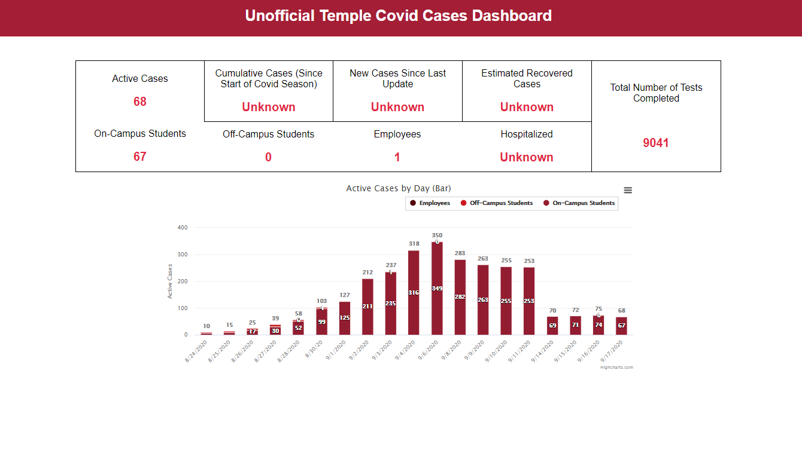
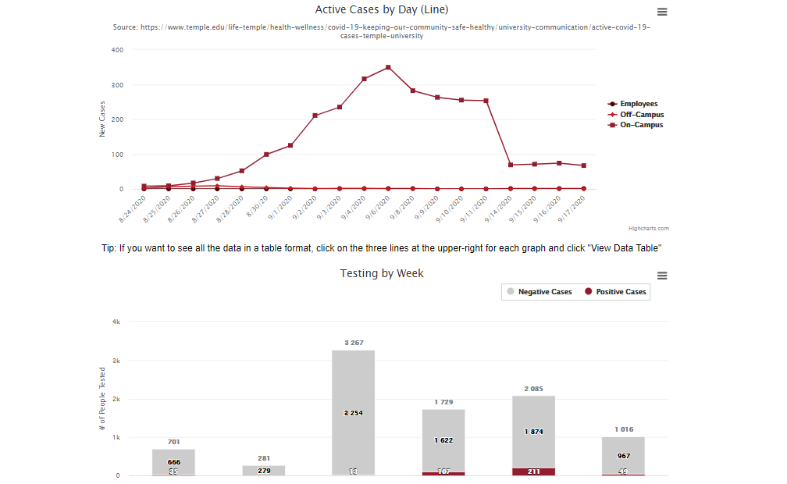
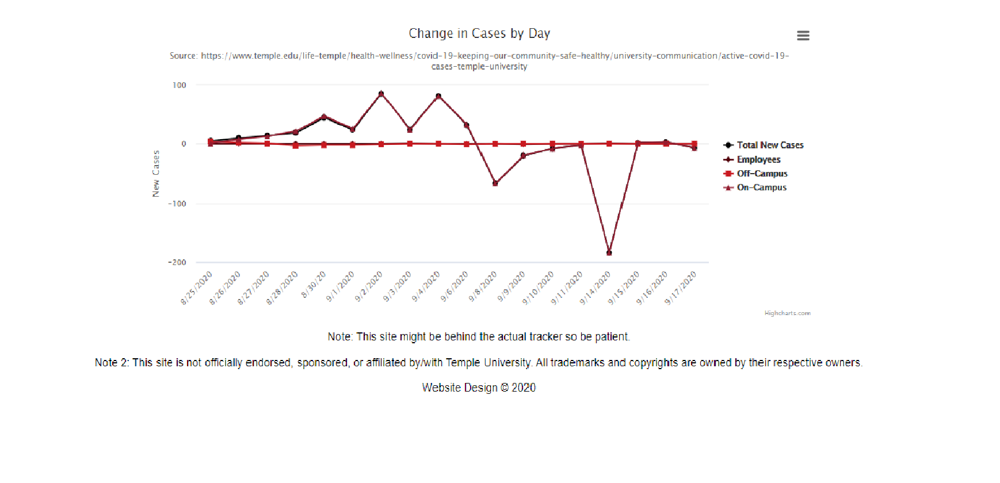

# Unofficial Covid Dashboard (https://temple-covid.herokuapp.com/)
Compiles data from my university's covid page. 

While the university's official covid dashboard only displays cases for one day and then promptly delets the data for the past days, my dashboard stores data for every day and compiles it into graphs and charts to see how the cases progress over time. 

Visitors can also see case stastics for every day unlike the [official dashboard](https://www.temple.edu/life-temple/health-wellness/covid-19-keeping-our-community-safe-healthy/university-communication/active-covid-19-cases-temple-university).

This site currently has 4 charts/graphs to show the progression of COVID throughout the semester.

## Screenshots




## Installation
```bash
$ pip install -r requirements.txt
$ flask run
```
